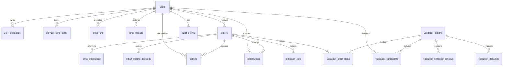

# Database Data Model & Schema Architecture
*Inbox Intelligence Layer (IIL) Backend — Schema Reference (Migrations 001–007)*

---

> **Implementation Baseline**: Backend Phases 1–4 and the validation operations infrastructure are implemented and structurally verified through automated tests. Real Google OAuth, live Gmail synchronization, real-provider extraction quality, manual forwarding feasibility, user demand, willingness to pay, and vertical selection still require owner-led validation. Phase 5–7 remain deferred.

---

## 1. Entity-Relationship (ER) Overview



---

## 2. Core Architectural Concepts

### 2.1 Model A Derived Ownership Schema
- **Design**: In `email_intelligence`, ownership derives strictly through `email_id → emails.user_id`.
- **Rationale**: `emails.id` is a globally unique internal UUID (`gen_random_uuid()`). Storing a denormalized `user_id` on `email_intelligence` introduced cross-tenant key risks. `email_intelligence` has a foreign key to `emails(id) ON DELETE CASCADE`, guaranteeing atomic deletion and single-source tenant isolation.

### 2.2 Dual Idempotency Key Design
- **`extraction_candidate_key`**: `SHA256(JSON({ k: 'candidate-v1', u: userId, e: emailId, t: entityType, ti: normalizedTitle, v: extractionVersion }))`. Used internally within an extraction run to deduplicate candidates.
- **`materialized_entity_key`**: `SHA256(JSON({ k: 'v1', u: userId, e: sourceEmailId, t: entityType, ti: normalizedTitle, dl: normalizedDeadline, tg: normalizedTarget, ca: normalizedCategory }))`. Stored in `actions.idempotency_key` and `opportunities.idempotency_key`. Stable across extraction versions.

### 2.3 Partial Unique Indexes for Concurrency
- `idx_sync_runs_active_user`: Enforces only one active (`pending`/`running`) sync run per user.
- `idx_extraction_runs_active_email`: Enforces only one active (`running`) extraction run per email.

---

## 3. Migration Summary (001–007)

| Migration | File | Description |
|---|---|---|
| `001` | `001_baseline_schema.sql` | Users, credentials, sync states, email threads, emails, actions, opportunities, approvals, executions, audit events. |
| `002` | `002_gmail_ingestion.sql` | Sync runs table, active user partial index, MIME metadata fields. |
| `003` | `003_intelligence_extraction.sql` | Extraction runs table, active email partial index, email intelligence table. |
| `004` | `004_phase1_4_audit_fixes.sql` | Immutability triggers on `audit_events`, Model A derived ownership on `email_intelligence`. |
| `005` | `005_runtime_integrity_fixes.sql` | Index optimization, rate limiting support. |
| `006` | `006_validation_program.sql` | 10 validation tables (cohorts, participants, interviews, attempts, labels, reviews, follow-ups, decisions, filtering decisions). |
| `007` | `007_validation_scoring_integrity.sql` | Score model alignment: replaces score range constraint with unclamped `raw_score NUMERIC NOT NULL` and `normalized_score NUMERIC NULL CHECK (null OR 0-1)`. |

---

## 4. Pre-LLM Noise Scoring Table Schema (`email_filtering_decisions`)

Altered by Migration `007_validation_scoring_integrity.sql`:

```sql
CREATE TABLE IF NOT EXISTS email_filtering_decisions (
  id UUID PRIMARY KEY DEFAULT gen_random_uuid(),
  email_id UUID NOT NULL REFERENCES emails(id) ON DELETE CASCADE,
  model_version TEXT NOT NULL,
  raw_score NUMERIC NOT NULL,
  normalized_score NUMERIC NULL CHECK (normalized_score IS NULL OR (normalized_score >= 0.0 AND normalized_score <= 1.0)),
  recommendation TEXT NOT NULL CHECK (recommendation IN ('process', 'deprioritize')),
  reasons JSONB NOT NULL DEFAULT '[]'::jsonb,
  mode TEXT NOT NULL CHECK (mode IN ('off', 'shadow', 'active')),
  created_at TIMESTAMPTZ NOT NULL DEFAULT NOW()
);
```

### Column Rules & Meanings
- **`raw_score`**: Additive rule score computed from matching heuristic signals (e.g. `+high_signal:shortlist`, `-low_signal:spam`). Unconstrained by probability limits; may be below `0.0` or above `1.0`.
- **`normalized_score`**: Calibrated probability float ($0.0$--$1.0$). Explicitly set to `NULL` pending probability calibration.
- **`recommendation`**: Pre-LLM recommendation (`'process'` if `raw_score >= 0.35`, else `'deprioritize'`).
- **`reasons`**: JSONB array of non-PII signal codes (e.g. `["+high_signal:interview", "-low_signal:unsubscribe"]`).
- **`mode`**: Operating mode (`'shadow'` during validation; `'active'` is rejected in production startup).

---

## 5. Validation Subsystem Tables (Migration 006)

1. `validation_cohorts`: Cohort metadata (`name`, `vertical`, `start_date`, `end_date`, `target_participant_count`, `decision_threshold_version`, `status`).
2. `validation_participants`: Participant enrolment (`cohort_id FK`, `user_id FK`, `persona_segment`, `recruitment_channel`, `oauth_invited`, `oauth_completed`, `forwarding_setup_completed`, `trust_accepted`, `continued_after_one_week`).
3. `validation_interview_records`: Qualitative discovery (`participant_id FK`, `problem_severity_score`, `manual_workflow_description`, `workflow_pain_points`, `willingness_to_pay_monthly_usd`, `raw_interview_notes_path`). Note: Raw transcript files must live outside git.
4. `validation_ingestion_attempts`: Channel setup tracking (`cohort_id FK`, `participant_id FK`, `ingestion_mode`, `setup_seconds`, `first_ingestion_success`, `admin_policy_blocked`).
5. `validation_email_labels`: Human ground-truth email labels (`cohort_id FK`, `email_id FK`, `reviewer_code`, `is_critical`, `should_create_action`, `should_create_opportunity`, `correct_category`, `correct_deadline`). Scoped strictly to emails in the cohort.
6. `validation_extraction_reviews`: Human candidate validation (`cohort_id FK`, `extraction_run_id FK`, `candidate_type`, `candidate_key`, `reviewer_code`, `is_valid`, `is_semantic_duplicate`, `rejection_reason`).
7. `validation_participant_follow_ups`: 1-week retention tracking (`participant_id FK`, `still_using_product`, `weekly_active_usage_days`, `primary_value_reported`, `churn_reason`, `nps_score`).
8. `validation_decisions`: Audit log of Go/No-Go decisions (`cohort_id FK`, `decision`, `passed_checks`, `failed_checks`, `missing_checks`, `rationale`).
