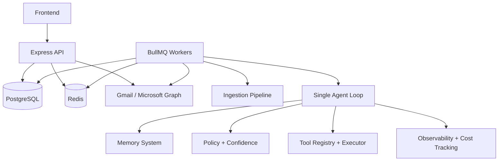
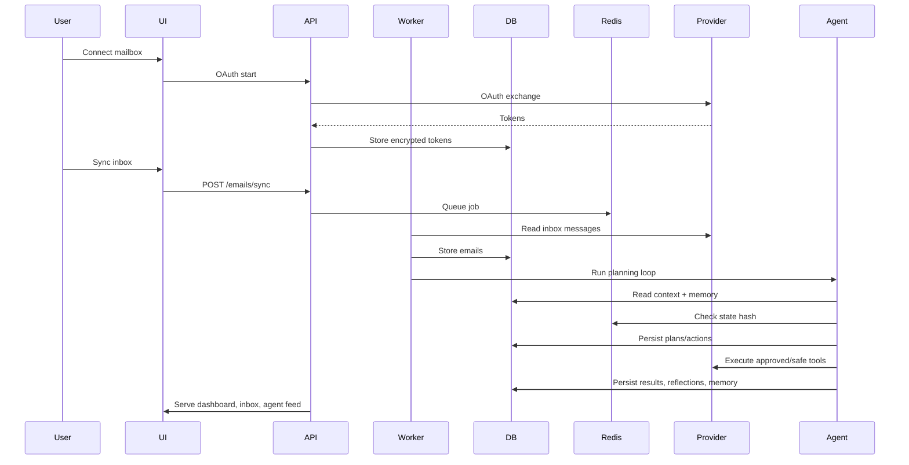
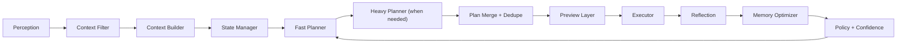

# Architecture

This document explains how Inbox Intelligence Layer is built, how data moves through the system, and where each production concern lives.

## System Overview

The product is a single-agent autonomous inbox operator. It does not use a multi-agent architecture. Instead, it keeps one goal-aware control loop with modular subsystems for perception, planning, execution, memory, policy, and recovery.

Primary design goals:

- Production safety over novelty
- Traceable decisions
- Idempotent execution
- Efficient AI usage
- Scalable async processing
- Human approval for risky actions

## Core Runtime Components

### Frontend

- React + Vite
- TypeScript
- Tailwind CSS
- Multi-page app shell with server-driven list screens

Primary responsibility:

- authentication handoff
- dashboard rendering
- approvals and preview actions
- task and inbox operations
- settings and goal management

### Backend API

- Express
- Zod validation
- Cookie and bearer authentication support
- Route groups for auth, tasks, emails, actions, feedback, preferences, and agent operations

Primary responsibility:

- product API surface
- auth/session management
- low-latency reads and writes
- preview approval and rollback endpoints

### Workers

- BullMQ + Redis
- background ingestion
- AI processing
- continuous and periodic planning

Primary responsibility:

- run expensive or asynchronous work outside request/response latency

### PostgreSQL

Primary system of record for:

- users
- emails
- extracted tasks
- plans and actions
- memory
- preferences
- feedback
- notifications
- LLM usage events and daily cost aggregates

### Redis

Used for:

- BullMQ queue backend
- hot cache
- last normalized state hash
- fast cost aggregate reads

## High-Level Component Graph

## End-To-End Data Flow

## Agent Loop

The agent loop is implemented in `backend/src/agent/coreLoop.ts`.

Logical stages:

1. Perceive
2. Filter context
3. Build context
4. Normalize decision state
5. Choose planning path
6. Dedupe and persist plan
7. Preview or execute
8. Reflect
9. Update memory and policy
10. Emit activity feed and product-facing summaries

### Agent Loop Diagram

## Key Agent Modules

### `backend/src/agent/contextFilter.ts`

Reduces noise before planning:

- keeps relevant emails
- promotes actionable tasks and events
- removes low-signal noise
- returns diagnostics for observability

### `backend/src/agent/stateManager.ts`

Avoids unnecessary LLM work:

- normalizes decision state
- removes non-semantic fields
- normalizes thread-level email data
- hashes only planning-relevant state
- stores last hash in Redis
- skips heavy planning if nothing materially changed

### `backend/src/agent/fastPlanner.ts`

Deterministic planner path:

- cheap to run
- modular rule sets
- returns partial plans fast

Rule modules:

- `backend/src/planner/rules/recruiterRules.ts`
- `backend/src/planner/rules/schedulingRules.ts`
- `backend/src/planner/rules/cleanupRules.ts`

### `backend/src/agent/heavyPlanner.ts`

LLM-backed planner path:

- only runs when state changed and budget allows
- sees filtered context, goals, strategist output, intents, and energy context

### `backend/src/agent/planMerge.ts`

Guarantees stable action sequences:

- merges fast and heavy planner outputs
- dedupes steps using tool + target + normalized input
- preserves order
- generates stable execution keys

### `backend/src/agent/preview.ts`

Human-aligned control layer:

- generates action previews
- generates workflow previews
- supports `approve`, `modify`, `cancel`, and `approve_all`

### `backend/src/agent/executor.ts`

Executes deduped plans:

- enforces approval policy
- uses confidence calibration
- retries failures
- persists action status
- preserves workflow ordering
- prevents duplicate action inserts

### `backend/src/agent/recovery.ts`

Safety and reversibility:

- undo executed actions when supported
- rollback workflows
- detect risky outcomes

### `backend/src/agent/strategist.ts`

Higher-level behavior tuning:

- adjusts focus areas
- nudges aggressiveness
- adapts based on historical outcomes

## Planning Inputs

Planner inputs are assembled from:

- filtered emails
- open tasks
- upcoming calendar events
- user goals
- strategist output
- short-term intents
- recent actions
- memory summaries
- energy context

Shared planner typing is defined in `backend/src/agent/planningTypes.ts`.

## Tool System

The tool registry is the boundary between agent decisions and real side effects.

Core files:

- `backend/src/tools/types.ts`
- `backend/src/tools/registry.ts`

Current tools:

- `create_task`
- `create_calendar_event`
- `draft_reply`
- `send_reply`
- `snooze`
- `mark_important`
- `archive_email`
- `delete_email`
- `move_to_folder`
- `label_email`

Each tool defines:

- schema validation
- execution logic
- risk level
- reversibility
- approval posture
- estimated time saved

## Memory System

Memory is split across product stores rather than a single vector-only store.

### Short-term memory

- recent emails
- recent actions
- pending previews

### Long-term memory

- user preferences
- goal tuning
- policy rules
- learned behavior patterns

### Episodic memory

- prior decisions
- outcomes
- reflections

Relevant files:

- `backend/src/memory/summary.ts`
- `backend/src/memory/optimizer.ts`

Memory optimizer rules:

- summarize stale episodic entries
- decay stale patterns toward neutral
- preserve active signals
- never compress persistent allow rules

## Policy and Confidence

Confidence is not static. Execution confidence is adjusted using:

- base LLM confidence
- historical accuracy
- recency weight
- context similarity

Policy and confidence files:

- `backend/src/agent/policy.ts`
- `backend/src/agent/confidence.ts`
- `backend/src/services/agentFeedback.ts`

## Observability and Cost

AI spend is tracked explicitly.

Files:

- `backend/src/observability/costTracker.ts`
- `backend/src/ai/llmProviders.ts`
- `backend/src/services/ai.ts`

Recorded metrics:

- provider
- model
- prompt tokens
- completion tokens
- total tokens
- request latency
- estimated cost
- cost per action
- cost per successful action
- cost per workflow

## Product-Facing Summary Layer

The dashboard and agent pages receive additive “magic moment” fields that make automation visible:

- `groupedActions`
- `workflowSummaries`
- `impact`

Implemented in:

- `backend/src/agent/magicOutput.ts`
- `backend/src/routes/tasks.ts`
- `backend/src/routes/agent.ts`

## Database Model

Primary tables:

- `users`
- `emails`
- `extracted_tasks`
- `user_preferences`
- `user_behavior_logs`
- `notifications`
- `user_goals`
- `agent_plans`
- `agent_actions`
- `agent_reflections`
- `agent_logs`
- `memory_store`
- `episodic_memory`
- `llm_usage_events`
- `llm_cost_daily_aggregates`

Schema and migrations:

- `backend/db/schema.sql`
- `backend/db/migrations/`

## Scale and Safety Principles

This architecture is intentionally conservative:

- one agent, not many
- async work isolated to workers
- deterministic planner path before expensive LLM planning
- skip planning when state has not changed
- approval before risky operations
- all actions persisted and traceable
- rollback pathways for reversible operations
