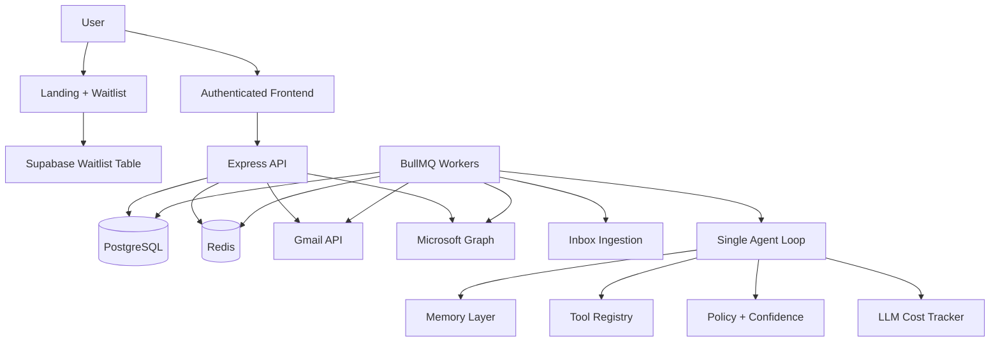
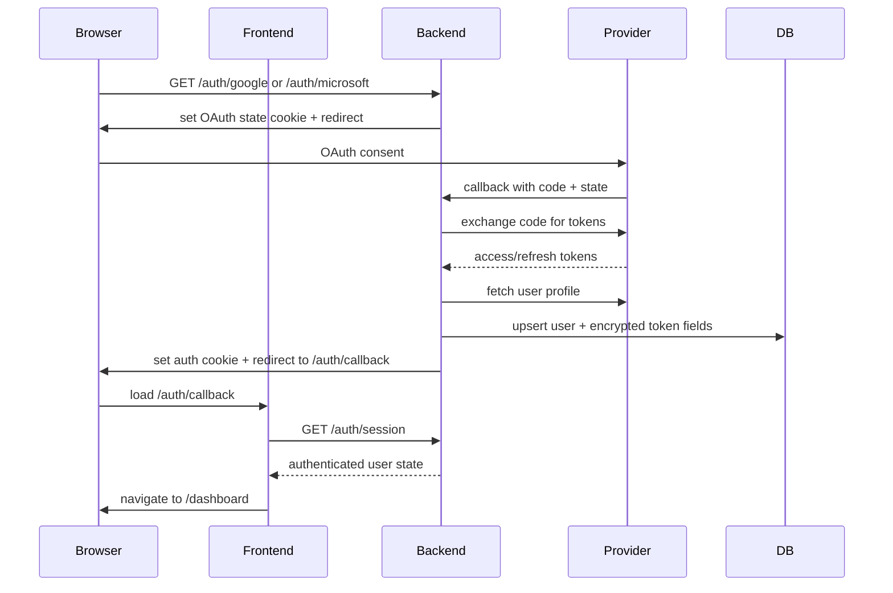
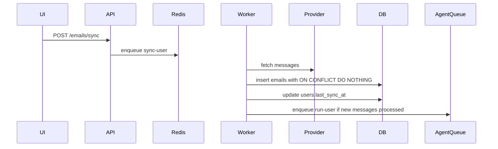

# Architecture

This document describes the current architecture of Student Intelligence Layer in depth.

It is written against the actual code in this repository, not an aspirational future design.

Core implementation anchors:

- `/Users/HP/outlook-bot/backend/src/app.ts`
- `/Users/HP/outlook-bot/backend/src/workers/index.ts`
- `/Users/HP/outlook-bot/backend/src/services/ingestion.ts`
- `/Users/HP/outlook-bot/backend/src/agent/coreLoop.ts`
- `/Users/HP/outlook-bot/frontend/src/App.tsx`
- `/Users/HP/outlook-bot/frontend/src/lib/api.ts`

## 1. System Intent

Student Intelligence Layer is a single-agent inbox operating system designed to turn raw mailbox traffic into structured work and then act on it safely.

The platform is intentionally optimized for:

- traceability over mystery
- async scalability over synchronous API-heavy workflows
- human-aligned approvals over fully opaque autonomy
- cost-aware planning over “call the LLM on everything” behavior
- product usability over prototype complexity

## 2. Architectural Style

The system combines several patterns:

### Product/API layer

- Express REST API
- session-aware frontend
- page-oriented SaaS UI

### Asynchronous processing layer

- BullMQ jobs backed by Redis
- ingestion and autonomous loop work outside request-response latency

### Single-agent autonomous runtime

- one goal-aware agent loop
- modular subsystems for context, planning, execution, preview, reflection, memory, and policy

### Durable operational state

- PostgreSQL as the product source of truth
- Redis as queue/cache/state-hash support layer

## 3. High-Level Topology

## 4. Main Runtime Flows

## 4.1 Public landing and waitlist flow

Current implementation:

- `/Users/HP/outlook-bot/frontend/src/pages/Landing.tsx`
- `/Users/HP/outlook-bot/frontend/src/lib/supabase.ts`

Flow:

1. User visits `/`.
2. Landing page renders brand experience and waitlist form.
3. Waitlist form validates email and optional role.
4. Frontend inserts directly into Supabase `waitlist` table.
5. Success/error is handled on the client.

Important note:

- the landing page also contains a hidden keyboard-triggered admin access path used to enter the authenticated product flow through backend OAuth.

## 4.2 OAuth and session flow

Current implementation:

- backend: `/Users/HP/outlook-bot/backend/src/routes/auth.ts`
- frontend: `/Users/HP/outlook-bot/frontend/src/pages/AuthCallback.tsx`
- session state: `/Users/HP/outlook-bot/frontend/src/lib/appContext.tsx`

Current session rules:

- frontend trust comes from `/auth/session`
- internal routes are protected in `/Users/HP/outlook-bot/frontend/src/App.tsx`
- `AppShell` renders only after the session resolves successfully
- cookie auth is primary, bearer token remains compatibility fallback

## 4.3 Inbox sync flow

Current implementation:

- route: `/Users/HP/outlook-bot/backend/src/routes/emails.ts`
- queue: `/Users/HP/outlook-bot/backend/src/queues/index.ts`
- worker: `/Users/HP/outlook-bot/backend/src/workers/ingestionWorker.ts`
- service: `/Users/HP/outlook-bot/backend/src/services/ingestion.ts`

Key characteristics:

- ingestion is provider-aware (`google` vs `microsoft`)
- provider responses are normalized into the `emails` table
- duplicate message insertion is prevented by `(user_id, message_id)` uniqueness
- sync only triggers agent execution when at least one new message is processed

## 4.4 Continuous agent loop

Current implementation:

- `/Users/HP/outlook-bot/backend/src/agent/coreLoop.ts`

The loop is the operational heart of the backend.

High-level stages:

1. fetch perception state
2. load goals
3. run strategist
4. load intent state
5. load energy context
6. filter planning context
7. build memory-aware context
8. compute normalized decision state hash
9. decide whether to skip planning
10. run fast planner
11. run heavy planner if required
12. merge and dedupe actions
13. persist plans
14. preview or execute actions
15. reflect on results
16. optimize memory
17. generate activity feed

## 5. Agent Loop In Detail

## 5.1 Perception

Implemented in `fetchPerception()` inside `/Users/HP/outlook-bot/backend/src/agent/coreLoop.ts`.

Current perception inputs:

- pending emails from `emails`
- open tasks from `extracted_tasks`
- recent actions from `agent_actions`
- upcoming calendar events from provider APIs

What is fetched:

### Pending emails

- newest pending emails only
- includes `thread_id`, sender, preview, importance, classification

### Open tasks

- open tasks only
- ordered by due date
- includes category and priority score

### Recent actions

- latest 20 agent actions
- used for short-term execution awareness and state hashing

### Upcoming events

- read directly from Google Calendar or Microsoft calendar APIs
- best-effort; failure here does not crash the loop

## 5.2 Goals, strategist, intent, and energy

### Goals

Loaded from:

- `/Users/HP/outlook-bot/backend/src/agent/goals.ts`
- stored in `user_goals`

Includes:

- weighted goals
- autopilot level
- personality mode

### Strategist

Loaded from:

- `/Users/HP/outlook-bot/backend/src/agent/strategist.ts`

Role:

- adjust priority weighting
- adjust planning aggressiveness
- adjust focus areas over time

### Intent

Loaded from:

- `/Users/HP/outlook-bot/backend/src/agent/intent.ts`

Role:

- short-term operator intent
- session overrides
- temporary priority boosts

### Energy

Loaded from:

- `/Users/HP/outlook-bot/backend/src/agent/energy.ts`

Role:

- provide time/behavior-aware hints about best execution timing and urgency posture

## 5.3 Context filter

Implemented in:

- `/Users/HP/outlook-bot/backend/src/agent/contextFilter.ts`

Purpose:

- reduce planning noise before building full context
- focus the planners on the most actionable subset of email/task/calendar data

Outputs typically include:

- filtered emails
- filtered tasks
- filtered events
- diagnostics explaining what was retained or dropped

Why it matters:

- planner quality improves when low-signal input is removed
- cost improves because heavy planning sees less irrelevant material

## 5.4 Context builder

Implemented in:

- `/Users/HP/outlook-bot/backend/src/agent/contextBuilder.ts`

Purpose:

- combine the filtered current-state inputs with memory summaries and recent behavior context

Output:

- summarized reasoning context for planners and reflection

## 5.5 State-aware skip

Implemented in:

- `/Users/HP/outlook-bot/backend/src/agent/stateManager.ts`

Purpose:

- skip planning when the decision-relevant environment has not changed

How it works:

1. build a normalized decision state from:
   - filtered emails
   - goals
   - intent state
   - strategist output
   - recent actions
2. remove non-semantic fields
3. compute a deterministic hash
4. compare with the previously stored hash in Redis
5. if unchanged, log a `state_skip` and bypass planning

Benefits:

- lower AI spend
- lower planner churn
- more stable autonomous behavior

## 5.6 Planner split

### Fast planner

Implemented in:

- `/Users/HP/outlook-bot/backend/src/agent/fastPlanner.ts`

Rule modules:

- `/Users/HP/outlook-bot/backend/src/planner/rules/recruiterRules.ts`
- `/Users/HP/outlook-bot/backend/src/planner/rules/schedulingRules.ts`
- `/Users/HP/outlook-bot/backend/src/planner/rules/cleanupRules.ts`

Purpose:

- cheap deterministic planning for obvious cases
- run before any expensive LLM reasoning

### Heavy planner

Implemented in:

- `/Users/HP/outlook-bot/backend/src/agent/heavyPlanner.ts`

Purpose:

- LLM-backed planning for cases that need deeper reasoning

Heavy planner is used only when:

- state changed
- enough time budget remains
- the fast planner did not provide enough coverage/confidence
- the filtered inbox includes signals warranting deeper reasoning

### Planner budget control

Current loop budget control is driven by:

- `AGENT_LOOP_MAX_MS`
- internal minimum heavy-planner budget threshold in `coreLoop.ts`

Meaning:

- continuous loops prefer staying responsive
- the system can fall back to fast-planner-only behavior under time pressure

## 5.7 Plan merge and dedupe

Implemented in:

- `/Users/HP/outlook-bot/backend/src/agent/planMerge.ts`

Purpose:

- merge planner outputs
- dedupe identical or near-identical actions
- preserve workflow order
- generate stable execution keys

Why it matters:

- fast and heavy planners can overlap
- retries and partial replans must not create duplicate downstream actions

## 5.8 Preview generation

Implemented in:

- `/Users/HP/outlook-bot/backend/src/agent/preview.ts`

Purpose:

- convert planned actions into user-reviewable summaries
- enrich actions with risk, undoability, and estimated time saved
- support workflow-level preview bundles

Preview types:

- per-action preview
- per-workflow preview

Supported preview decisions:

- approve
- modify
- cancel
- approve-all for workflow bundles

## 5.9 Execution

Implemented in:

- `/Users/HP/outlook-bot/backend/src/agent/executor.ts`

The executor is responsible for:

- resolving execution context (email, message, task)
- calculating adjusted confidence using policy/confidence helpers
- deciding whether to discard, preview, or execute
- creating `agent_actions` records
- calling tools through the registry
- handling retries and partial failures
- writing decision traces
- recording workflow-level metrics

Execution decision model currently considers:

- tool approval requirement
- tool risk level
- autopilot level
- personality mode
- historical accuracy
- recency weight
- context similarity
- persistent policy allowances like `always_allow`

## 5.10 Reflection

Implemented in:

- `/Users/HP/outlook-bot/backend/src/agent/reflection.ts`

Purpose:

- evaluate how the executed plan performed
- store post-execution analysis in `agent_reflections`

## 5.11 Memory optimization

Implemented in:

- `/Users/HP/outlook-bot/backend/src/memory/optimizer.ts`

Purpose:

- summarize stale episodic memory
- decay stale patterns
- preserve active signals and policy-critical data

Important safeguard behavior:

- active patterns are preserved
- recent signals are preserved
- `always_allow` and related policy state are not compressed away

## 5.12 Activity feed generation

Implemented in:

- `/Users/HP/outlook-bot/backend/src/agent/activityFeed.ts`

Purpose:

- generate the daily summary shown on the frontend agent page

## 6. Tool System

Primary files:

- `/Users/HP/outlook-bot/backend/src/tools/types.ts`
- `/Users/HP/outlook-bot/backend/src/tools/registry.ts`

The tool system is the boundary between reasoning and real-world side effects.

Each tool declares:

- `name`
- input `schema`
- `safe`
- `requiresApproval`
- `riskLevel`
- `reversible`
- `estimatedSecondsSaved`
- optional `validate`
- optional `undo`
- `execute`

Current tools:

- `create_task`
- `create_calendar_event`
- `draft_reply`
- `send_reply`
- `snooze`
- `mark_important`
- `archive_email`
- `delete_email`
- `move_to_folder`
- `label_email`

Provider-aware behavior exists for Gmail and Outlook-compatible operations.

## 7. Provider Integration Model

## Gmail

Relevant files:

- `/Users/HP/outlook-bot/backend/src/services/gmail.ts`
- `/Users/HP/outlook-bot/backend/src/routes/auth.ts`
- tool implementations that branch on provider config

Responsibilities:

- OAuth URL generation and callback exchange
- profile lookup
- inbox message listing and detail reads
- calendar event interactions
- mailbox write operations such as label/archive/draft/send when supported

## Microsoft Graph

Relevant files:

- `/Users/HP/outlook-bot/backend/src/services/graph.ts`
- `/Users/HP/outlook-bot/backend/src/routes/auth.ts`
- `/Users/HP/outlook-bot/backend/src/routes/webhooks.ts`

Responsibilities:

- OAuth URL generation and callback exchange
- profile lookup
- inbox message listing
- calendar event interactions
- webhook subscription creation

## 8. Queue Topology

Queues are defined in:

- `/Users/HP/outlook-bot/backend/src/queues/index.ts`

### Ingestion queue

Responsibilities:

- `sync-all`
- `sync-user`

Worker:

- `/Users/HP/outlook-bot/backend/src/workers/ingestionWorker.ts`

### Agent queue

Responsibilities:

- `run-all`
- user-specific agent runs

Worker:

- `/Users/HP/outlook-bot/backend/src/workers/aiProcessor.ts`

Current recurring schedule from worker bootstrap:

- sync every 5 minutes
- agent core every 5 minutes

## 9. Frontend Architecture

## 9.1 Routing

Defined in:

- `/Users/HP/outlook-bot/frontend/src/App.tsx`

Characteristics:

- public landing route
- public auth callback route
- protected internal routes
- authenticated shell rendered via `AppShell`

## 9.2 Session model

Defined in:

- `/Users/HP/outlook-bot/frontend/src/lib/appContext.tsx`

Characteristics:

- frontend trusts backend `/auth/session`
- stale local token is not treated as valid auth by itself
- sync state is managed centrally for page reuse

## 9.3 API client

Defined in:

- `/Users/HP/outlook-bot/frontend/src/lib/api.ts`

Characteristics:

- consistent base URL handling
- timeout and retry protection
- normalized logging and errors
- typed route wrappers

## 9.4 Page model

Internal pages are list-oriented and server-driven rather than client-only state demos.

Design goals reflected in the implementation:

- pagination instead of giant in-memory lists
- explicit loading / empty / processing states
- lightweight row views for larger datasets
- a persistent app shell rather than isolated screens

## 10. Observability Model

## Logging

Backend logging:

- pino logger
- pino-http request logging
- agent logs in `agent_logs`
- decision traces in `decision_traces`

Frontend logging:

- API logs from `/Users/HP/outlook-bot/frontend/src/lib/api.ts`
- session logs from `/Users/HP/outlook-bot/frontend/src/lib/appContext.tsx`
- agent approval logs from `/Users/HP/outlook-bot/frontend/src/pages/Agent.tsx`

## AI usage and cost

Implemented in:

- `/Users/HP/outlook-bot/backend/src/observability/costTracker.ts`

Durable tables:

- `llm_usage_events`
- `llm_cost_daily_aggregates`

Purpose:

- trace provider/model usage
- estimate per-request and per-workflow spend
- support cost-per-action and cost-per-successful-action metrics

## 11. Safety Model

The platform is autonomous, but not unconstrained.

Current safety principles in code:

- high-risk actions are approval-gated
- preview state is explicit and persisted
- action execution is traceable
- undo and rollback exist where tool implementations allow it
- duplicate action creation is constrained by idempotency keys and plan dedupe
- planner work is skipped when decision-relevant state is unchanged

## 12. Failure Behavior

### If provider read fails during perception

- the loop continues with empty calendar context where possible
- inbox sync failures are logged by workers

### If no new messages are ingested

- agent run is not queued from `syncUserInbox()`

### If no plan is produced

- state hash is still stored
- a `plan_empty` log event is recorded

### If confidence is too low

- the step is discarded, not blindly executed

### If approval is required or auto-execution is disallowed

- preview action records are created for the UI to surface

### If execution fails

- action status and traces capture the failure
- workflow failure counts feed observability and reflection

## 13. Current Architectural Constraints To Be Aware Of

These are important when reading or evolving the system:

1. The active runtime is `coreLoop.ts`, but older agent files still exist in the repo.
2. The backend env loader currently requires Microsoft env vars even in Gmail-first testing.
3. Direct `/actions/reply` can send when explicitly invoked with `send: true`, even though autonomous send remains human-gated.
4. Some backend workflow-level capabilities are richer than the current frontend surface that consumes them.
5. The product is strongly production-shaped, but a first-class automated test suite is still missing from the repository.

## 14. Reading Path For New Engineers

If you are joining the project, use this sequence:

1. `/Users/HP/outlook-bot/README.md`
2. `/Users/HP/outlook-bot/docs/CODEMAP.md`
3. `/Users/HP/outlook-bot/docs/DATABASE.md`
4. `/Users/HP/outlook-bot/backend/src/app.ts`
5. `/Users/HP/outlook-bot/backend/src/routes/auth.ts`
6. `/Users/HP/outlook-bot/backend/src/services/ingestion.ts`
7. `/Users/HP/outlook-bot/backend/src/agent/coreLoop.ts`
8. `/Users/HP/outlook-bot/backend/src/agent/executor.ts`
9. `/Users/HP/outlook-bot/frontend/src/App.tsx`
10. `/Users/HP/outlook-bot/frontend/src/lib/api.ts`

## 15. Summary

The shortest accurate description of the current system is:

- a multi-page SaaS frontend
- backed by a route-based Node API
- fed by async provider ingestion
- powered by a single goal-aware autonomous agent loop
- grounded in PostgreSQL durability, Redis-backed queues/cache, and explicit approval + traceability controls
