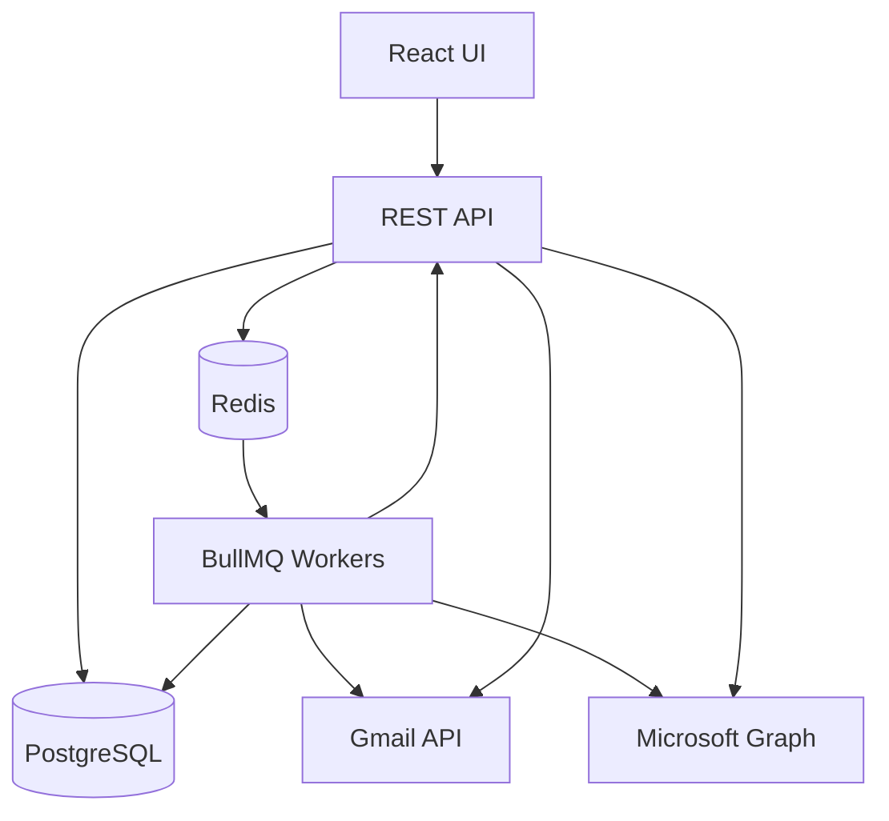
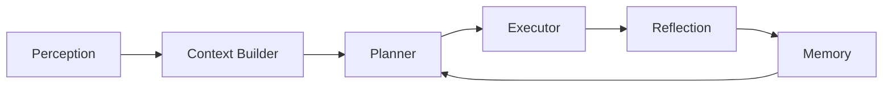

# Architecture

This document explains how the system is built and how data flows end-to-end.

## High-Level Components

- **Frontend (React + Vite)**: multi-page UI with a shared shell and server-side pagination
- **API (Node.js + Express)**: REST endpoints, auth, rate limiting, validation
- **Workers (BullMQ + Redis)**: async ingestion and agent loop
- **Database (PostgreSQL)**: emails, tasks, actions, plans, memory, preferences
- **Providers**: Gmail API + Microsoft Graph

## Component Diagram

## Core Data Flow

1. User connects Gmail/Outlook via OAuth.
2. Tokens are encrypted and stored in `users`.
3. Ingestion worker pulls new messages into `emails`.
4. AI extraction runs, producing `extracted_tasks` + metadata.
5. Agent loop builds a plan and creates actions in `agent_actions`.
6. Executor performs safe actions or creates approval items.
7. Reflection + memory update influence future planning.
8. UI fetches dashboards and paginated lists.

## Agent Loop (Plan -> Act -> Reflect)

## Key Storage Tables

- `users` - OAuth tokens + user metadata
- `emails` - ingested email records
- `extracted_tasks` - AI-extracted tasks
- `agent_plans` - plan history
- `agent_actions` - decisions + execution
- `agent_reflections` - post-action reflections
- `memory_store` - short/long-term memory

