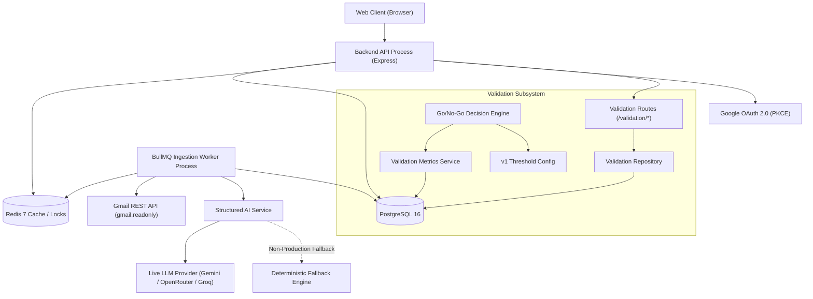

# System Architecture & Component Design
*Obligo Backend — Implementation Reference*

---

> **Implementation Baseline**: Backend Phases 1–4 and the validation operations infrastructure are implemented and structurally verified through automated tests. Real Google OAuth, live Gmail synchronization, real-provider extraction quality, manual forwarding feasibility, user demand, willingness to pay, and vertical selection still require owner-led validation. Phase 5–7 remain deferred.

---

## 1. Subsystem Architecture Overview

The Obligo backend is an **execution layer built on top of communication**. In Phases 1–4, the architecture focuses strictly on read-only inbox synchronization, MIME parsing, structured AI extraction, candidate entity materialization, shadow-mode noise scoring, and internal validation program infrastructure.

```mermaid
graph TD
  Client["Web Client (Browser)"] --> API["Backend API Process (Express)"]
  API --> DB[(PostgreSQL 16)]
  API --> Redis[(Redis 7 Cache / Locks)]
  API --> Google["Google OAuth 2.0 (PKCE)"]

  Worker["BullMQ Ingestion Worker Process"] --> Redis
  Worker --> DB
  Worker --> GmailAPI["Gmail REST API (gmail.readonly)"]
  Worker --> StructuredAI["Structured AI Service"]

  StructuredAI --> LLMProvider["Live LLM Provider (Gemini / OpenRouter / Groq)"]
  StructuredAI -. "Non-Production Fallback" .-> FallbackEngine["Deterministic Fallback Engine"]

  subgraph Validation Subsystem
    ValRoutes["Validation Routes (/validation/*)"] --> ValRepo["Validation Repository"]
    ValRepo --> DB
    ValMetrics["Validation Metrics Service"] --> DB
    ValDecision["Go/No-Go Decision Engine"] --> ValMetrics
    ValDecision --> ThresholdConfig["v1 Threshold Config"]
  end

  API --> ValRoutes
```

---

## 2. Component Breakdown

### 2.1 Backend API Process (`backend/src/app.ts`, `server.ts`)
- Express REST API server running on Node.js (ES modules).
- Handles OAuth authentication (`/auth/google`), session management (`/auth/session`), synchronization triggers (`/emails/sync`), email reading (`/emails`), extraction triggering (`/emails/:id/extract`), intelligence retrieval (`/emails/:id/intelligence`), and internal validation tooling (`/validation/*`).
- Protects endpoints via session cookies/Bearer JWTs or pre-shared `X-Validation-Token` headers.

### 2.2 Background Worker Process (`backend/src/workers/index.ts`)
- BullMQ worker consuming async background jobs from Redis queues.
- Executes `gmail_sync` jobs: initial sync, incremental history sync, and history cursor reconciliation fallback.
- Enforces user-scoped Redis Lua locks to prevent concurrent sync runs per user (`idx_sync_runs_active_user`).

### 2.3 Persistence Layer (PostgreSQL 16)
- Migration schema `001` through `007`.
- Multi-tenant data model using **Model A derived ownership**: `emails`, `actions`, `opportunities`, and `email_filtering_decisions` are scoped to users via `email_id FK -> emails(id) -> user_id`.
- Immutable audit trail (`audit_events`) enforced via PostgreSQL trigger rejecting `UPDATE` and `DELETE`.

### 2.4 Cache & Locking Layer (Redis 7)
- Distributed Lua locks (`obligo:lock:sync:<userId>`, `obligo:lock:extract:<emailId>`) for atomic state operations, renewal, and compare-and-DEL release.
- Rate-limiting window storage (`obligo:ratelimit:<route>:<ip>`).
- Atomic OAuth state consumption via `GETDEL`.

### 2.5 Structured AI Service (`backend/src/ai/structuredAiService.ts`)
- Calls live external LLM providers (Gemini via `AI_MODEL`, e.g. `gemini-flash-latest`; or OpenRouter / Groq) using Zod schema validation (`EmailExtractionSchema`).
- Resolves execution path explicitly via `resolveAnalysisPath()`:
  - `injected_provider` / `configured_provider`: Calls LLM API.
  - `deterministic_fallback`: Executes deterministic rule engine (permitted ONLY in non-production environments when `AI_FALLBACK_ENABLED=true`).
  - `unavailable`: Throws HTTP 503 `EXTRACTION_PROVIDER_UNAVAILABLE`.
- Enforces 30-second timeout via `AbortSignal` with clean timer teardown.

### 2.6 Pre-LLM Noise Scoring Engine (`backend/src/services/emailScoringService.ts`)
- Pre-LLM heuristic scorer outputting additive `raw_score` (`NUMERIC NOT NULL`, unclamped) and `normalized_score` (`null` until probability calibration exists).
- Operates in shadow mode (`EMAIL_SCORING_MODE=shadow`). Scores are persisted to `email_filtering_decisions` but never alter queue order or discard emails.
- Active queue scheduling mode (`EMAIL_SCORING_MODE=active`) is **rejected during startup** in production.

### 2.7 Internal Validation Subsystem (`backend/src/services/validation*`)
- 10 validation tables tracking cohorts, participants, interview records, ingestion attempts, human ground-truth labels, extraction reviews, and 1-week follow-ups.
- Deterministic Go/No-Go decision engine (`validationDecisionService.ts`) evaluating cohort metrics against versioned thresholds (`v1`) and segmented `MinimumSampleSize` criteria.
- External held-out quality benchmark boundary (`validation.quality.ts`) reading from external gitignored `VALIDATION_HELDOUT_CORPUS_PATH`.

---

## 3. Explicit Architecture Boundaries & Unimplemented/Deferred Scope

| Component / Feature | Current Status | Notes / Rationale |
|---|---|---|
| **Telegram Integration** | ❌ Unimplemented | Out of scope for Phase 1–4 base. |
| **Inbound Forwarding Webhook (Postmark / SendGrid)** | ❌ Unimplemented | Forwarding path is an unvalidated hypothesis; manual forwarding experiment guide created for offline testing. |
| **Payments & Referrals** | ❌ Unimplemented | Billing and referral tracking deferred until vertical demand is validated. |
| **Phase 5 Customer Dashboard & Product APIs** | ⏸️ Deferred | Endpoints `/dashboard`, `/actions`, `/opportunities`, `/approvals` remain unbuilt. |
| **Phase 6 Write Execution & Approvals** | ⏸️ Deferred | `POST /approvals/:id/approve` and Gmail write scopes (`gmail.modify`, `gmail.send`) remain unbuilt. |
| **Phase 7 Agent Orchestration & Planners** | ⏸️ Deferred | Single-agent loop, Fast Planner, Heavy Planner, strategist, and memory optimization remain unbuilt. |
| **Microsoft Graph / Outlook Integration** | ❌ Unimplemented | Future roadmap consideration after Gmail vertical validation. |
