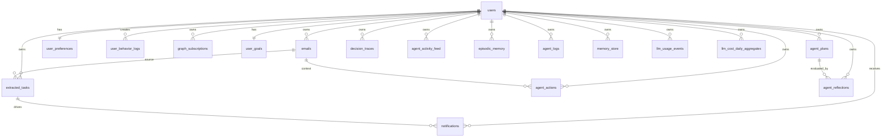

# Database Guide

This document explains the PostgreSQL schema used by Student Intelligence Layer.

Authoritative schema file:

- `/Users/HP/outlook-bot/backend/db/schema.sql`

This guide focuses on:

- what each table stores
- how tables relate to each other
- which runtime components read or write them
- which indexes matter for scale
- what to inspect during debugging and operations

## Database Role In The System

PostgreSQL is the durable system of record for the product.

It stores:

- user identity and provider token fields
- ingested emails
- extracted tasks and deadlines
- preferences and goals
- lightweight user behavior feedback
- autonomous plans and actions
- decision traces and reflections
- memory state
- LLM usage and cost aggregates

Redis is used for queueing, cache, and state hashes, but PostgreSQL is the source of truth for product state.

## Extension Requirements

The schema enables:

- `pgcrypto`
- `pg_trgm`

Purpose:

- `pgcrypto` supports UUID generation
- `pg_trgm` supports trigram-based search indexes for inbox and task search

## Relationship Overview



## Migration Inventory

Current migration files:

1. `/Users/HP/outlook-bot/backend/db/migrations/002_agent_system.sql`
2. `/Users/HP/outlook-bot/backend/db/migrations/003_autopilot_level.sql`
3. `/Users/HP/outlook-bot/backend/db/migrations/004_agent_enhancements.sql`
4. `/Users/HP/outlook-bot/backend/db/migrations/005_personality_mode.sql`
5. `/Users/HP/outlook-bot/backend/db/migrations/006_google_integration.sql`
6. `/Users/HP/outlook-bot/backend/db/migrations/007_productization_indexes.sql`
7. `/Users/HP/outlook-bot/backend/db/migrations/008_autonomous_operator_hardening.sql`

For greenfield environments, use `/Users/HP/outlook-bot/backend/db/schema.sql`.

## Table-by-Table Reference

## `users`

Purpose:

- master user record
- mailbox provider identity mapping
- encrypted provider token storage
- sync freshness tracking

Important columns:

- `id` — internal UUID primary key
- `ms_user_id` — Microsoft provider user identifier
- `email` — primary user email, unique
- `display_name` — display name from provider profile
- `tenant_id` — Microsoft tenant context
- `ms_access_token`, `ms_refresh_token`, `ms_token_expires_at`
- `google_user_id`
- `google_access_token`, `google_refresh_token`, `google_token_expires_at`
- `primary_provider` — current canonical provider (`microsoft` default in schema)
- `last_sync_at` — last completed sync timestamp
- `created_at`, `updated_at`

Primary writers:

- `/Users/HP/outlook-bot/backend/src/services/users.ts`
- `/Users/HP/outlook-bot/backend/src/services/ingestion.ts` updates `last_sync_at`

Primary readers:

- `/Users/HP/outlook-bot/backend/src/services/tokens.ts`
- auth/session flows
- worker sync and agent loop paths

Index:

- `users_email_idx` on `email`

Operational note:

- token values are encrypted before persistence through utilities in `/Users/HP/outlook-bot/backend/src/utils/crypto.ts`

## `emails`

Purpose:

- normalized mailbox ingestion store
- raw message metadata surface for both UI and agent runtime

Important columns:

- `id` — internal UUID
- `user_id` — owner
- `message_id` — provider message identifier
- `thread_id` — provider conversation/thread identifier when available
- `subject`
- `sender_email`
- `sender_name`
- `received_at`
- `body_preview`
- `importance`
- `raw_json` — provider raw record payload
- `ai_json` — structured AI output blob when available
- `classification`
- `ai_score`
- `processed_at`
- `status` — typically `pending` or `processed`
- `created_at`, `updated_at`

Primary writers:

- `/Users/HP/outlook-bot/backend/src/services/ingestion.ts`
- AI processing paths update enrichment fields

Primary readers:

- `/Users/HP/outlook-bot/backend/src/routes/emails.ts`
- `/Users/HP/outlook-bot/backend/src/agent/coreLoop.ts`
- action and preview context resolution logic

Uniqueness:

- unique `(user_id, message_id)`

Indexes:

- `emails_user_received_idx`
- `emails_message_idx`
- `emails_user_status_received_idx`
- `emails_user_classification_received_idx`
- `emails_search_idx` (trigram search on subject/sender)

Why it matters:

- this is the canonical mailbox state the UI and agent both inspect
- duplicate sync protection largely depends on the unique user/message key

## `extracted_tasks`

Purpose:

- structured tasks, deadlines, and opportunities derived from email

Important columns:

- `id`
- `user_id`
- `email_id` — source email reference
- `title`
- `description`
- `due_at`
- `link`
- `category`
- `status` — `open`, `snoozed`, `completed`
- `priority_score`
- `source_type` — currently defaults to `email`
- `created_at`, `updated_at`

Primary writers:

- extraction / tool paths such as `create_task`

Primary readers:

- `/Users/HP/outlook-bot/backend/src/services/tasks.ts`
- `/Users/HP/outlook-bot/backend/src/routes/tasks.ts`
- direct actions that resolve `taskId`
- the agent perception stage for open tasks

Indexes:

- `extracted_tasks_user_due_idx`
- `extracted_tasks_user_status_priority_due_idx`
- `extracted_tasks_user_category_priority_due_idx`
- `extracted_tasks_search_idx`

Why it matters:

- almost every user-visible page outside the inbox depends on this table

## `user_preferences`

Purpose:

- durable category weight settings for a user

Important columns:

- `user_id`
- `weights` JSONB
- `created_at`, `updated_at`

Primary writers/readers:

- `/Users/HP/outlook-bot/backend/src/services/preferences.ts`
- `/Users/HP/outlook-bot/backend/src/routes/preferences.ts`

## `user_behavior_logs`

Purpose:

- lightweight event log for user feedback and product behavior signals

Important columns:

- `user_id`
- `email_id`
- `action`
- `metadata`
- `created_at`

Primary writers:

- `/Users/HP/outlook-bot/backend/src/services/feedback.ts`

Index:

- `behavior_user_created_idx`

## `notifications`

Purpose:

- reminder / notification scheduling store

Important columns:

- `user_id`
- `task_id`
- `type`
- `scheduled_for`
- `sent_at`
- `status`
- `created_at`

Index:

- `notifications_user_status_scheduled_idx`

Current note:

- this table exists in the product model even though the current frontend does not expose a notification management surface yet

## `graph_subscriptions`

Purpose:

- store Microsoft Graph webhook subscriptions

Important columns:

- `user_id`
- `subscription_id`
- `resource`
- `expiration_date_time`
- `client_state`
- `created_at`

Primary writers:

- `/Users/HP/outlook-bot/backend/src/routes/auth.ts` during Microsoft OAuth callback when webhook config is enabled

Primary readers:

- `/Users/HP/outlook-bot/backend/src/routes/webhooks.ts`

Uniqueness:

- `graph_subscriptions_user_idx` on `(user_id, subscription_id)`

## `user_goals`

Purpose:

- durable goal and execution posture state for the agent

Important columns:

- `user_id`
- `goals` JSONB array
- `autopilot_level`
- `personality_mode`
- `created_at`, `updated_at`

Primary writers/readers:

- `/Users/HP/outlook-bot/backend/src/agent/goals.ts`
- `/Users/HP/outlook-bot/backend/src/routes/agent.ts`
- `/Users/HP/outlook-bot/backend/src/agent/coreLoop.ts`

## `agent_actions`

Purpose:

- single most important execution table in the autonomous system
- stores suggested, previewed, executed, failed, cancelled, and undoable actions

Important columns:

- `id`
- `user_id`
- `email_id`
- `workflow_id`
- `workflow_name`
- `action_type`
- `action_payload`
- `confidence`
- `decision_reason`
- `status`
- `requires_approval`
- `idempotency_key`
- `created_at`, `updated_at`

Primary writers:

- `/Users/HP/outlook-bot/backend/src/agent/executor.ts`
- `/Users/HP/outlook-bot/backend/src/agent/actionStore.ts`
- preview approval / recovery flows update status

Primary readers:

- `/Users/HP/outlook-bot/backend/src/routes/agent.ts`
- `/Users/HP/outlook-bot/backend/src/agent/coreLoop.ts` for recent action context
- `/Users/HP/outlook-bot/backend/src/agent/preview.ts`
- `/Users/HP/outlook-bot/backend/src/agent/recovery.ts`

Uniqueness and idempotency:

- unique index on `(user_id, email_id, action_type, idempotency_key)`

Indexes:

- `agent_actions_user_status_created_idx`

Why it matters:

- this table is the core audit trail for autonomous behavior
- duplicates and retries are controlled through `idempotency_key`

## `agent_plans`

Purpose:

- persist generated plans from the planner layer

Important columns:

- `user_id`
- `plan_type` — typically `continuous` or `daily`
- `plan` JSONB
- `status`
- `created_at`, `updated_at`

Primary writers/readers:

- `/Users/HP/outlook-bot/backend/src/agent/planner.ts`
- `/Users/HP/outlook-bot/backend/src/agent/coreLoop.ts`

## `agent_reflections`

Purpose:

- store reflection output after execution

Important columns:

- `user_id`
- `plan_id`
- `reflection` JSONB
- `created_at`

Primary writers:

- `/Users/HP/outlook-bot/backend/src/agent/reflection.ts`

## `decision_traces`

Purpose:

- full reasoning chain persistence for auditability

Important columns:

- `user_id`
- `plan_id`
- `workflow_id`
- `input`
- `reasoning`
- `decision`
- `action`
- `result`
- `created_at`

Primary writers:

- `/Users/HP/outlook-bot/backend/src/agent/decisionTrace.ts`
- called from `/Users/HP/outlook-bot/backend/src/agent/executor.ts`

This table is central when debugging:

- why a step was discarded
- why it required approval
- why a confidence score changed
- what result came back from execution

## `agent_activity_feed`

Purpose:

- daily summary surface for the frontend agent page

Important columns:

- `user_id`
- `summary_date`
- `summary` JSONB
- `created_at`

Uniqueness:

- one row per user per summary date

Primary writers/readers:

- `/Users/HP/outlook-bot/backend/src/agent/activityFeed.ts`
- `/Users/HP/outlook-bot/backend/src/routes/agent.ts`

## `episodic_memory`

Purpose:

- store past context/outcome pairs for longer-term memory

Important columns:

- `user_id`
- `context`
- `outcome`
- `created_at`

Primary writers/readers:

- memory subsystem in `/Users/HP/outlook-bot/backend/src/memory/episodic.ts`
- context builder / optimizer paths

## `agent_logs`

Purpose:

- structured operational logs for agent steps

Important columns:

- `user_id`
- `email_id`
- `step`
- `message`
- `data`
- `created_at`

Primary writers:

- `/Users/HP/outlook-bot/backend/src/agent/logs.ts`

Use this table to inspect:

- state skips
- preview generation issues
- plan-empty events
- workflow start/failure details

## `memory_store`

Purpose:

- generalized long-term and scoped memory key/value store

Important columns:

- `user_id`
- `scope`
- `key`
- `value`
- `expires_at`
- `created_at`, `updated_at`

Uniqueness:

- unique `(user_id, scope, key)`

Index:

- `memory_scope_idx`

Used for things like:

- summarized memory
- policy state
- long-term patterns
- caches of learned signals

## `llm_usage_events`

Purpose:

- raw durable event stream for LLM usage and estimated cost

Important columns:

- `user_id`
- `workflow_key`
- `provider`
- `model`
- `operation`
- `prompt_tokens`
- `completion_tokens`
- `total_tokens`
- `latency_ms`
- `estimated_cost`
- `actions_created`
- `successful_actions`
- `metadata`
- `created_at`

Primary writers:

- `/Users/HP/outlook-bot/backend/src/observability/costTracker.ts`

Indexes:

- `llm_usage_events_user_created_idx`
- `llm_usage_events_user_workflow_idx`

## `llm_cost_daily_aggregates`

Purpose:

- summarized daily cost and efficiency metrics for user/workflow slices

Important columns:

- `user_id`
- `summary_date`
- `workflow_key`
- `total_requests`
- `prompt_tokens`
- `completion_tokens`
- `total_tokens`
- `total_cost`
- `actions_created`
- `successful_actions`
- `cost_per_action`
- `cost_per_successful_action`
- `cost_per_workflow`
- `created_at`, `updated_at`

Uniqueness:

- unique `(user_id, summary_date, workflow_key)`

Index:

- `llm_cost_daily_user_summary_idx`

## Common Query Paths In The Product

### Session bootstrap

Uses:

- `users`

### Inbox page

Uses:

- `emails`

### Dashboard / Tasks / Deadlines / Opportunities

Uses:

- `extracted_tasks`
- `emails` for message IDs and source linkage
- `agent_actions` for additive summary fields on dashboard responses

### Agent page

Uses:

- `agent_actions`
- `agent_activity_feed`
- `emails` via join for subject/sender display

### Core loop perception phase

Uses:

- `emails`
- `extracted_tasks`
- `agent_actions`
- `user_goals`
- memory tables

### Preview / undo / rollback flows

Uses:

- `agent_actions`
- `emails`
- `extracted_tasks`
- memory/policy state where applicable

## Recommended Debugging Queries

### Find recent emails for a user

```sql
SELECT id, subject, sender_email, received_at, classification, status
FROM emails
WHERE user_id = '<user-uuid>'
ORDER BY received_at DESC
LIMIT 50;
```

### Find recent tasks for a user

```sql
SELECT id, title, category, due_at, priority_score, status
FROM extracted_tasks
WHERE user_id = '<user-uuid>'
ORDER BY created_at DESC
LIMIT 50;
```

### Find recent agent actions

```sql
SELECT id, action_type, workflow_name, status, confidence, created_at
FROM agent_actions
WHERE user_id = '<user-uuid>'
ORDER BY created_at DESC
LIMIT 50;
```

### Find preview actions waiting for approval

```sql
SELECT id, action_type, workflow_name, status, decision_reason
FROM agent_actions
WHERE user_id = '<user-uuid>'
  AND status IN ('preview', 'suggest', 'suggested', 'modified')
ORDER BY created_at DESC;
```

### Inspect decision traces for a workflow

```sql
SELECT workflow_id, input, reasoning, decision, action, result, created_at
FROM decision_traces
WHERE user_id = '<user-uuid>'
  AND workflow_id = '<workflow-id>'
ORDER BY created_at ASC;
```

### Inspect cost by day

```sql
SELECT summary_date, workflow_key, total_cost, total_requests, cost_per_action, cost_per_successful_action
FROM llm_cost_daily_aggregates
WHERE user_id = '<user-uuid>'
ORDER BY summary_date DESC, workflow_key;
```

## Operational Notes

### Tables that grow quickly

Expect faster growth in:

- `emails`
- `agent_actions`
- `decision_traces`
- `agent_logs`
- `llm_usage_events`

These tables should be reviewed regularly for:

- index effectiveness
- retention policy decisions
- backup size implications

### Tables critical for product correctness

If these are unhealthy, the product is materially broken:

- `users`
- `emails`
- `extracted_tasks`
- `agent_actions`
- `user_goals`
- `memory_store`

### Tables critical for observability and trust

If these are unhealthy, the product may still function but becomes harder to trust or operate:

- `decision_traces`
- `agent_reflections`
- `agent_logs`
- `agent_activity_feed`
- `llm_usage_events`
- `llm_cost_daily_aggregates`

## Summary

If you want a short mental model:

- `users` stores identity and provider credentials
- `emails` stores normalized mailbox state
- `extracted_tasks` stores structured work
- `agent_plans` and `agent_actions` store autonomous intent and execution
- `decision_traces`, `agent_logs`, and `agent_reflections` explain what happened
- `memory_store` and `episodic_memory` let the system improve over time
- `llm_usage_events` and `llm_cost_daily_aggregates` make AI cost visible
