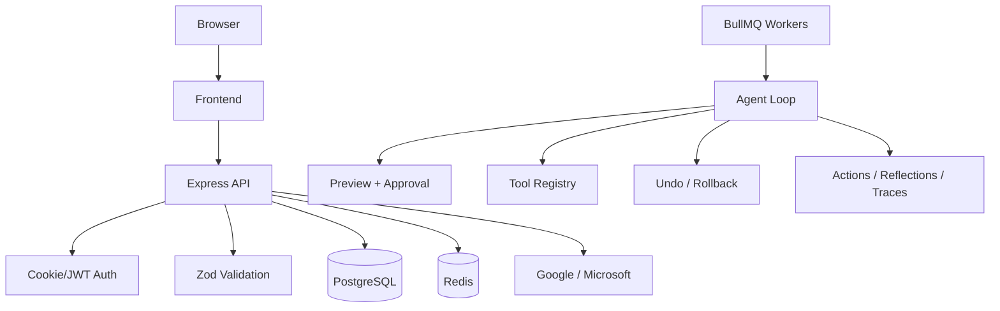

# Security Guide

This document explains the current security posture of Student Intelligence Layer, what is already implemented in code, and what still requires strong operational discipline in production.

It is grounded in the current repository, especially:

- `/Users/HP/outlook-bot/backend/src/app.ts`
- `/Users/HP/outlook-bot/backend/src/routes/auth.ts`
- `/Users/HP/outlook-bot/backend/src/middleware/auth.ts`
- `/Users/HP/outlook-bot/backend/src/middleware/validate.ts`
- `/Users/HP/outlook-bot/backend/src/agent/preview.ts`
- `/Users/HP/outlook-bot/backend/src/agent/executor.ts`
- `/Users/HP/outlook-bot/backend/src/agent/recovery.ts`
- `/Users/HP/outlook-bot/backend/src/agent/policy.ts`
- `/Users/HP/outlook-bot/backend/src/memory/optimizer.ts`
- `/Users/HP/outlook-bot/backend/src/observability/costTracker.ts`
- `/Users/HP/outlook-bot/frontend/src/lib/appContext.tsx`
- `/Users/HP/outlook-bot/frontend/src/lib/api.ts`

## 1. Security Goals

The product handles deeply sensitive information:

- mailbox content
- school and internship deadlines
- recruiter conversations
- calendar scheduling data
- provider OAuth tokens
- behavioral preferences and approval history

The security goals are therefore:

1. prevent unauthorized access to user data
2. prevent unsafe autonomous actions
3. keep all meaningful decisions traceable
4. reduce blast radius when one subsystem fails
5. maintain product trust under real-world operational pressure

## 2. Threat Model Summary

This is the practical threat model for the current product.

### 2.1 Account and session threats

- stolen cookies or bearer tokens
- invalid session reuse across apps
- OAuth callback manipulation
- unauthenticated access to protected routes

### 2.2 Provider integration threats

- over-scoped Google or Microsoft permissions
- leaked provider access or refresh tokens
- webhook spoofing or replay attempts
- invalid redirect URI configuration

### 2.3 Application-layer threats

- malformed payloads to write endpoints
- approval replay or workflow misuse
- action duplication under concurrent execution
- unsafe tool invocation through crafted inputs

### 2.4 Data and privacy threats

- token leakage at rest
- over-retention of sensitive email-derived memory
- insecure backups
- accidental exposure of logs containing user context

### 2.5 Autonomy-specific threats

- low-confidence autonomous actions executing too aggressively
- unsafe actions being auto-approved by policy drift
- memory corruption causing repeated harmful behavior
- planner loops causing runaway cost or action spam

## 3. Security Architecture Overview



The platform security model is not based on blind trust in the agent. It is based on layered controls:

- authenticated access
- validated input
- risk-aware tool policies
- preview and approval gates
- idempotent action execution
- rollback support
- persistent audit records

## 4. Authentication and Session Security

## 4.1 Session model

Current behavior is implemented in:

- `/Users/HP/outlook-bot/backend/src/routes/auth.ts`
- `/Users/HP/outlook-bot/backend/src/middleware/auth.ts`
- `/Users/HP/outlook-bot/frontend/src/lib/appContext.tsx`

Current model:

- backend issues a JWT after successful OAuth
- the JWT is primarily delivered through an HttpOnly cookie
- frontend bootstraps auth state exclusively from `GET /auth/session`
- bearer token handling exists only as a compatibility fallback

Important security property:

- the frontend no longer trusts local storage as proof of authentication
- session truth comes from the backend response

## 4.2 JWT controls

Current controls:

- JWT signing with `AUTH_JWT_SECRET`
- issuer enforcement through `AUTH_JWT_ISSUER`
- audience enforcement through `AUTH_JWT_AUDIENCE`
- 7-day expiry on issued JWTs

Why this matters:

- it narrows token reuse across applications
- it prevents naive acceptance of otherwise valid tokens from another context

## 4.3 Cookie controls

Current auth cookie options in `/Users/HP/outlook-bot/backend/src/routes/auth.ts`:

- `httpOnly: true`
- `sameSite: 'lax'`
- `secure: env.nodeEnv === 'production'`
- `path: '/'`
- `maxAge: 7 days`

Production implication:

- cookie theft is still high impact, but the token is intentionally hidden from frontend JavaScript when cookie mode is used
- production deployments must run behind HTTPS so the `secure` cookie path is actually enforced

## 4.4 Protected frontend routes

Internal pages are protected in:

- `/Users/HP/outlook-bot/frontend/src/App.tsx`

Current security property:

- `AppShell` does not render for unauthenticated users
- protected routes redirect to `/`
- session loading is resolved before the internal UI is shown, preventing route leakage and auth flicker

## 5. OAuth Security

## 5.1 Google OAuth

Current implementation:

- `/Users/HP/outlook-bot/backend/src/routes/auth.ts`
- `/Users/HP/outlook-bot/backend/src/services/gmail.ts`

Controls:

- state cookie issued before redirect
- callback verifies returned `state`
- failed validation clears auth cookie and returns to frontend callback with error state

## 5.2 Microsoft OAuth

Current implementation:

- `/Users/HP/outlook-bot/backend/src/routes/auth.ts`
- `/Users/HP/outlook-bot/backend/src/services/graph.ts`

Controls:

- state cookie issued before redirect
- callback verifies returned `state`
- Graph subscription creation is tied to the authenticated user after successful token exchange

## 5.3 Provider token protection

Provider token persistence is handled through:

- `/Users/HP/outlook-bot/backend/src/services/users.ts`
- `/Users/HP/outlook-bot/backend/src/services/tokens.ts`
- `/Users/HP/outlook-bot/backend/src/utils/crypto.ts`

Current security property:

- provider access and refresh tokens are encrypted before persistence
- application code retrieves and decrypts them only when needed for provider operations

Operational requirement:

- `TOKEN_ENC_KEY` must be treated like a root secret
- compromise of `TOKEN_ENC_KEY` significantly weakens token-at-rest protection

## 6. API Surface Hardening

## 6.1 Request headers and edge protection

Current controls in `/Users/HP/outlook-bot/backend/src/app.ts`:

- `helmet()`
- `x-powered-by` disabled
- `referrerPolicy: no-referrer`
- `crossOriginResourcePolicy: cross-origin`
- CORS restricted to configured frontend origins

## 6.2 Rate limiting

Current controls:

- global limiter on the app
- stricter limiter on auth routes
- dedicated limiter on webhook routes

Why this matters:

- slows credential abuse and low-effort scraping
- gives basic protection against bursty misuse on public surfaces
- reduces accidental operational self-harm during frontend retry storms

## 6.3 Input validation

Current validation layer:

- Zod schemas on route inputs
- `validate()` middleware in `/Users/HP/outlook-bot/backend/src/middleware/validate.ts`

This is especially important for:

- task filters and pagination
- action endpoints
- preview approval and modify flows
- goals, feedback, and intent updates

Security benefit:

- prevents the API from accepting broad, malformed, or unsafe payloads by default

## 7. Frontend Reliability as a Security Feature

Security is not just backend controls. Reliable client behavior reduces confusing and unsafe user experiences.

Implemented frontend hardening includes:

- session truth from backend only
- protected routes for internal pages
- request timeout and retry-once logic for GET requests in `/Users/HP/outlook-bot/frontend/src/lib/api.ts`
- consistent transport error normalization
- top-level error boundary in `/Users/HP/outlook-bot/frontend/src/main.tsx`

Why this matters:

- prevents accidental exposure of internal layout before auth resolves
- reduces silent failure states that can lead operators to misdiagnose security or data issues
- makes debugging production auth/session incidents significantly easier

## 8. Autonomous Action Safety Model

This is one of the most important parts of the product.

The agent is autonomous, but it is not unconstrained.

## 8.1 Tool registry controls

Tool contracts live in:

- `/Users/HP/outlook-bot/backend/src/tools/types.ts`
- `/Users/HP/outlook-bot/backend/src/tools/registry.ts`

Each tool defines:

- name
- input schema
- validation rules
- risk level
- reversibility
- optional undo support
- estimated saved time metadata

## 8.2 High-risk versus low-risk tools

Current posture:

- `label_email` — low risk
- `archive_email` — low risk
- `mark_important` — low risk
- `move_to_folder` — medium risk
- `create_task` — low to medium operational impact depending on context
- `create_calendar_event` — medium impact because it changes scheduling state
- `draft_reply` — medium impact but not externally sent
- `send_reply` — guarded, human approval required
- `delete_email` — high risk, never auto-executed

## 8.3 Preview and approval layer

Preview logic lives in:

- `/Users/HP/outlook-bot/backend/src/agent/preview.ts`

Current safety controls:

- action previews for non-auto-approved work
- workflow-level `approve-all`
- modify-before-execute support
- cancel support
- decision reason and confidence retained on actions

Why this matters:

- the user can see what the system intends to do before risky work executes
- the system can remain useful without demanding all-or-nothing autonomy

## 8.4 Recovery and rollback

Recovery logic lives in:

- `/Users/HP/outlook-bot/backend/src/agent/recovery.ts`

Current controls:

- undo support for reversible actions
- workflow rollback support
- action-level traceability for what happened

Security benefit:

- lowers blast radius of incorrect autonomous execution
- makes it safer to operate with higher autopilot levels for low-risk tools

## 9. Decision Traceability and Auditability

Current persistent audit surface includes:

- `agent_actions`
- `agent_plans`
- `agent_reflections`
- `decision_traces`
- `agent_logs`
- `agent_activity_feed`
- `llm_usage_events`
- `llm_cost_daily_aggregates`

These let the team reconstruct:

```text
input -> context -> plan -> preview -> approval -> execution -> result -> reflection
```

Operational implication:

- this product is much more debuggable than a stateless “ask an LLM and hope” design
- it is realistic to investigate whether a tool fired, why it fired, whether the user approved it, and what it cost

## 10. State-Aware and Memory-Aware Safety

## 10.1 State-aware planner skipping

Current logic in:

- `/Users/HP/outlook-bot/backend/src/agent/stateManager.ts`

Security and reliability benefit:

- avoids planner thrash on semantically unchanged state
- reduces repeated execution pressure
- lowers the probability of generating duplicate actions from inconsequential updates

## 10.2 Context filtering

Current logic in:

- `/Users/HP/outlook-bot/backend/src/agent/contextFilter.ts`

Benefit:

- reduces planner exposure to irrelevant noise
- lowers the chance of acting on junk signals

## 10.3 Policy and always-allow controls

Current logic in:

- `/Users/HP/outlook-bot/backend/src/agent/policy.ts`

Security note:

- `always_allow` is powerful and should be treated as durable authorization intent, not just a UI preference
- policy state is intentionally preserved by the memory optimizer

## 10.4 Memory optimizer safeguards

Current logic in:

- `/Users/HP/outlook-bot/backend/src/memory/optimizer.ts`

Implemented safeguards include:

- active patterns are not compressed away
- recently used signals are preserved
- `always_allow` policy rules are not summarized away
- stale signals decay instead of remaining permanently strong

Why this matters:

- the system keeps learning signals while reducing the risk of old, low-quality memory dominating future behavior

## 11. Data Protection and Privacy Posture

## 11.1 Sensitive data classes

The system processes:

- message subjects and sender metadata
- body previews and provider raw JSON
- task titles/descriptions and due dates
- calendar event summaries and schedule data
- user goals, preferences, and feedback
- provider access and refresh tokens

## 11.2 What is protected today

Implemented today:

- provider token encryption at rest
- protected REST routes for user data
- auditability of actions and decisions
- authenticated session model
- rate limiting and validation

## 11.3 What operators still must do

Operationally required in production:

- managed secrets instead of plaintext sharing
- encrypted database storage and encrypted backups
- database access restricted by network and role
- centralized logging with access controls and retention policy
- staff access review for production systems
- documented data retention decisions

## 12. Cost and Abuse Detection

Current tracking in `/Users/HP/outlook-bot/backend/src/observability/costTracker.ts` records:

- per-request token counts
- model/provider used
- latency
- estimated cost
- cost per action
- cost per successful action
- cost per workflow

Security value:

- detects runaway loops and planner regressions
- highlights unusual spikes tied to specific workflows or users
- gives an early signal when an attack or bug is triggering repeated LLM calls

## 13. Webhook Security

Current webhook entry point:

- `POST /webhooks/graph`

Implemented controls:

- separate rate limiter
- Graph `validationToken` support
- subscription lookup in `graph_subscriptions`
- optional `clientState` verification

Operational caution:

- the webhook endpoint must be exposed over public HTTPS
- ingress logs should be retained
- only valid subscription notifications should enqueue sync work

## 14. Frontend Public Surface Considerations

The landing page is intentionally public and includes:

- marketing content
- Supabase waitlist submission
- hidden keyboard-triggered admin access path

Operational implication:

- the public frontend is not just static content; it is part of the product attack surface
- Supabase waitlist table permissions and uniqueness constraints matter
- frontend environment variables for Supabase are required and should be managed carefully

## 15. Security Checklist Before Production Launch

Minimum launch checklist:

1. enforce HTTPS at the edge
2. use exact production `FRONTEND_URL` values
3. store all secrets in a real secret manager
4. use different Google/Azure apps for local, staging, and production
5. review provider scopes and remove unused permissions
6. confirm auth cookie is `secure` in production
7. confirm `/auth/session` works only with valid cookies/tokens
8. verify protected frontend routes do not leak internal shell state
9. confirm `delete_email` and `send_reply` remain human-gated
10. verify rollback paths work for reversible actions
11. confirm rate limiting is functioning under burst traffic
12. confirm backups are encrypted and restore-tested
13. confirm production logs do not leak raw tokens
14. confirm Supabase waitlist table has a uniqueness constraint on email

## 16. Security Testing Priorities

The highest-value security test areas are:

### Authentication and session

- cookie theft assumptions
- bearer token fallback behavior
- invalid issuer or audience rejection
- logout correctness
- protected route access without session

### OAuth

- invalid `state`
- replayed callback attempts
- provider redirect URI mismatch
- scope drift between configured app and expected app behavior

### API validation

- malformed query params
- invalid preview payloads
- invalid action IDs and workflow IDs
- unsafe folder or label names

### Autonomy controls

- can `delete_email` ever auto-execute?
- can `send_reply` bypass approval?
- do duplicate plans create duplicate side effects?
- do rollback/undo endpoints enforce ownership correctly?

### Queue and concurrency

- duplicate sync jobs
- repeated approval requests
- retries after partial workflow failure
- action idempotency under worker restarts

Use `/Users/HP/outlook-bot/docs/TESTING.md` for the broader product validation matrix.

## 17. Known Security Constraints And Honest Notes

A few important realities should be documented explicitly:

- the codebase still supports bearer auth as a compatibility fallback; cookie-first remains the intended secure path
- the frontend includes debug logging for stability and should be reviewed before broad production exposure
- the landing page waitlist depends on client-side Supabase access and therefore on correct Supabase table policy design
- the backend currently requires Microsoft env vars at boot even if only Gmail is being used
- the repo does not yet contain a comprehensive automated security test suite

## 18. Recommended Operational Ownership

Security in this product is shared across roles:

### Frontend ownership

- route protection behavior
- session bootstrap behavior
- safe error handling
- landing waitlist env and client configuration

### Backend ownership

- auth/session enforcement
- validation and rate limiting
- tool safety, previews, and rollback
- provider token encryption

### Ops / platform ownership

- TLS
- secrets management
- network isolation
- backup security
- centralized logging and alerting
- incident response process

## 19. If You Need To Audit The Product Quickly

Read these files in order:

1. `/Users/HP/outlook-bot/backend/src/routes/auth.ts`
2. `/Users/HP/outlook-bot/backend/src/middleware/auth.ts`
3. `/Users/HP/outlook-bot/backend/src/app.ts`
4. `/Users/HP/outlook-bot/backend/src/agent/preview.ts`
5. `/Users/HP/outlook-bot/backend/src/agent/executor.ts`
6. `/Users/HP/outlook-bot/backend/src/agent/recovery.ts`
7. `/Users/HP/outlook-bot/backend/src/agent/policy.ts`
8. `/Users/HP/outlook-bot/backend/src/memory/optimizer.ts`
9. `/Users/HP/outlook-bot/frontend/src/lib/appContext.tsx`
10. `/Users/HP/outlook-bot/frontend/src/App.tsx`
